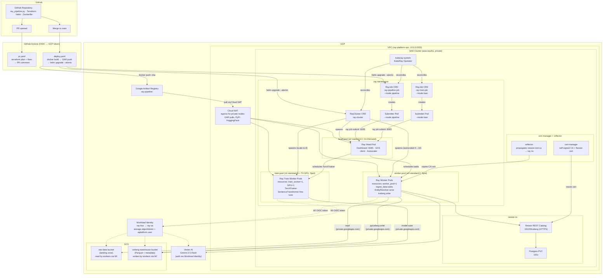

# Ray AI Platform on GKE — Design Document

> **Interview Reference** — this document is the source of truth for the technical walkthrough.

## Table of Contents

1. [Solution Overview](#1-solution-overview)
2. [Architecture Diagram](#2-architecture-diagram)
3. [Python Pipeline — Function-by-Function](#3-python-pipeline--function-by-function)
4. [Infrastructure (Terraform)](#4-infrastructure-terraform)
5. [Kubernetes Platform (KubeRay)](#5-kubernetes-platform-kuberay)
6. [Node Pool Strategy and Spot Instances](#6-node-pool-strategy-and-spot-instances)
7. [Zero-Trust Security Model](#7-zero-trust-security-model)
8. [Data Layer — Apache Iceberg via Nessie](#8-data-layer--apache-iceberg-via-nessie)
9. [CI/CD Pipeline](#9-cicd-pipeline)
10. [Observability](#10-observability)
11. [Spot Instance Resilience and Failure Simulation](#11-spot-instance-resilience-and-failure-simulation)
12. [Key Tradeoffs and Design Decisions](#12-key-tradeoffs-and-design-decisions)
13. [Runbook Snippets](#13-runbook-snippets)

---

## 1. Solution Overview

This platform deploys a **production-grade Ray distributed ML pipeline** on **Google Kubernetes Engine (GKE)**, managed by the **KubeRay operator**. The pipeline runs as a scheduled Kubernetes job and does the following end-to-end:

1. **Ingests** corporate entity data in parallel from two sources (GCS Parquet or synthetic via Faker)
2. **Resolves** entity names using a stateful Ray Actor backed by **Vertex AI Gemini 2.5 Flash** — normalises variant company names to canonical legal names
3. **Writes** resolved records atomically to an **Apache Iceberg** table via the **Nessie REST catalog**
4. Optionally **trains** a `SentenceTransformer` embedding model on the resolved entity pairs using **Ray Train** on GPU workers

**Key design philosophy:**
- **Zero secrets** — no API keys, no service account key files anywhere. Authentication is entirely through GCP Workload Identity.
- **Zero-trust networking** — Calico NetworkPolicy default-deny-all on all namespaces; explicit allowlists per service.
- **Spot-first workers** — 60–91% cost reduction. Ray's built-in retry handles preemptions transparently.
- **KubeRay CRDs** — the modern, production-supported way to run Ray on Kubernetes.

**Stack summary:**

| Component | Choice | Reason |
|---|---|---|
| Cloud / Kubernetes | GKE (private, asia-south1) | Managed control plane, native Workload Identity, tight GAR/GCS integration |
| Ray orchestration | KubeRay Operator | Manages Ray cluster lifecycle as K8s CRDs |
| Iceberg catalog | Nessie (in-cluster, Helm) | Self-contained REST catalog, no external dependency |
| Nessie backing store | Postgres (in-cluster) | Helm chart native, lightweight for this scale |
| Object storage | GCS | Iceberg warehouse + raw data landing |
| Pod identity | GCP Workload Identity | Keyless — no static credentials anywhere |
| LLM / entity resolution | Vertex AI Gemini 2.5 Flash via WI | Zero secrets; WI authenticates to `aiplatform.googleapis.com` |
| Container registry | Google Artifact Registry | Co-located with GKE, IAM-native pull auth |
| Bastion access | IAP tunnel to private VM | No open ports, gated by Google identity |
| IaC | Terraform + GCS backend | Remote state, native GCS locking |
| K8s packaging | Helm chart | Typed values, `--atomic` rollback, templated image refs |
| CI/CD | GitHub Actions + WIF | Short-lived OIDC tokens; no long-lived GCP credentials in GitHub |

---

## 2. Architecture Diagram



---

## 3. Python Pipeline — Function-by-Function

The pipeline is in [docker/ray_pipeline.py](docker/ray_pipeline.py). It has two modes invoked from CLI:
- `--mode pipeline` — ingest → resolve → write to Iceberg
- `--mode train` — build training pairs from Iceberg → distributed GPU training

### Module-level configuration (lines 12–20)

All configuration is pulled from environment variables injected by the Helm chart at deploy time:

```python
NESSIE_URI        = os.environ.get("NESSIE_URI",        "https://nessie.nessie-ns:19120/iceberg")
ICEBERG_WAREHOUSE = os.environ.get("ICEBERG_WAREHOUSE", "gs://ray-iceberg-warehouse/warehouse")
GCP_PROJECT       = os.environ.get("GOOGLE_CLOUD_PROJECT", "")
VERTEX_REGION     = os.environ.get("VERTEX_REGION",     "asia-south1")
MODEL_OUTPUT_PATH = os.environ.get("MODEL_OUTPUT_PATH", "")
NUM_WORKERS       = int(os.environ.get("NUM_WORKERS", "2"))
SOURCE_A_PATH     = os.environ.get("SOURCE_A_PATH", "")
SOURCE_B_PATH     = os.environ.get("SOURCE_B_PATH", "")
```

None of these are secrets. `GOOGLE_CLOUD_PROJECT` and `VERTEX_REGION` are injected as plain env vars in `raycluster.yaml`. No `LLM_API_KEY` exists — Vertex AI uses Workload Identity.

---

### `ingest_data(source_name, source_path, n=1000)` — lines 23–36

```python
@ray.remote(resources={"worker_pool": 1})
def ingest_data(source_name: str, source_path: str, n: int = 1000) -> pd.DataFrame:
```

**What it does:** Distributed data ingestion task. Runs as a Ray remote task on a worker node.

**Two modes:**
- **prod** (`source_path` set): reads Parquet files from GCS using `ray.data.read_parquet(source_path)`, converts to pandas. This is the Ray Data integration — Parquet reads are parallelised at block level.
- **dev** (`source_path` empty): generates 1,000 fake company records using the `Faker` library with columns: `corporate_name`, `revenue` (uniform $1M–$10B), `source`.

**Scheduling:** `resources={"worker_pool": 1}` pins this task to worker-pool nodes. The head node does not advertise `worker_pool`, so it can never be scheduled there.

**Parallelism:** Two calls are made simultaneously from `run_pipeline()`:
```python
ds1_ref = ingest_data.remote("dataset_a", a_path)
ds2_ref = ingest_data.remote("dataset_b", b_path)
df1, df2 = ray.get([ds1_ref, ds2_ref])   # blocks until both done
```
Both execute concurrently on separate worker nodes.

---

### `EntityResolver` class — lines 44–124

```python
@ray.remote(resources={"worker_pool": 1})
class EntityResolver:
```

**What it is:** A stateful Ray Actor for LLM-based entity resolution. A Ray Actor is a long-lived process — unlike a remote task, it holds state across calls. All method invocations route to the same Python process.

**Scheduling:** Same `resources={"worker_pool": 1}` as `ingest_data` — ensures the actor lands on a worker-pool Spot node, never on the head. The head must stay free for scheduling; loading it with LLM calls would degrade the whole cluster.

#### `__init__(self)` — lines 46–51

Initialises the Vertex AI client once when the actor is first scheduled:

```python
vertexai.init(project=GCP_PROJECT, location=VERTEX_REGION)
self._model = GenerativeModel("gemini-2.5-flash")
```

Authentication is fully automatic — `vertexai.init()` uses Google Application Default Credentials (ADC). On GKE with Workload Identity, ADC resolves to the `ray-sa` GCP service account which has `roles/aiplatform.user`. **No API key is needed.**

#### `_call_with_retry(self, prompt)` — lines 53–78

Internal method. Wraps a single Gemini call with retry logic:

- **429 ResourceExhausted** (quota exceeded): exponential backoff — waits 1s, 2s, 4s, 8s, 16s before giving up after 5 attempts.
- **503/500 transient errors**: fixed 2-second retry, up to 3 attempts.
- **All other errors** (auth failure, invalid argument): propagate immediately — no point retrying.

This is production-grade resilience. Gemini's quota is per-minute, so the exponential backoff correctly waits out the quota window.

#### `_resolve_chunk(self, names: list[str])` — lines 80–103

Resolves a single batch of up to 50 company names in **one Gemini API call**:

1. Formats them as a numbered list: `1. Acme Corp\n2. IBM Inc\n...`
2. Sends a strict prompt: `"Return only the canonical legal names... one per line in the same order, prefixed with the same number. No explanations."`
3. Parses the numbered response, strips the prefix (`"1. "` or `"1) "`), returns the canonical names.
4. Validates that the response has exactly `len(names)` entries — raises `ValueError` if Gemini added or dropped lines.

Batching 50 names per call (instead of 1) reduces API calls from 2,000 to ~40, dramatically cutting latency and cost.

#### `resolve_batch(self, df: pd.DataFrame)` — lines 105–124

The main public method called by the pipeline driver:

1. Splits `df["corporate_name"]` into chunks of 50 (`_GEMINI_BATCH_SIZE`)
2. Calls `_resolve_chunk()` for each chunk, pausing 1 second between chunks to stay under the RPM quota
3. Adds three new columns to the DataFrame:
   - `canonical_name` — Gemini's normalised output (e.g. `"International Business Machines Corporation"`)
   - `canonical_id` — first 16 hex chars of `SHA256(canonical_name.lower())` — stable, deterministic identifier
   - `is_resolved = True`
4. Returns the enriched DataFrame

**Why SHA256 for the ID?** Stable across runs — the same canonical name always produces the same ID. Lowercase before hashing handles capitalisation variants. 16 hex chars = 64 bits of entropy, sufficient to avoid collisions in a 2,000-row dataset.

---

### `write_to_iceberg(df: pd.DataFrame)` — lines 128–161

**What it does:** Writes the resolved DataFrame to the `default.corporate_registry` Iceberg table via Nessie.

**Steps:**
1. Connects to the Nessie catalog using `pyiceberg.catalog.load_catalog()` with `uri=NESSIE_URI, ref="main", warehouse=ICEBERG_WAREHOUSE`. The `ref="main"` means all operations target Nessie's main branch.
2. Creates the `default` namespace if it doesn't exist.
3. Converts the pandas DataFrame to a PyArrow Table.
4. **If table exists:** calls `table.overwrite(arrow_table)` — ACID overwrite. Nessie atomically swaps the metadata pointer; concurrent writers get a 409 and retry.
5. **If table doesn't exist** (`NoSuchTableError`): creates it with an explicit 6-column schema first, then overwrites.

**Schema:**
```
corporate_name  STRING
revenue         DOUBLE
source          STRING
canonical_name  STRING
canonical_id    STRING
is_resolved     BOOLEAN
```

**Why Iceberg:** plain Parquet has no ACID — two concurrent writers corrupt the dataset. Iceberg's metadata layer (commit via Nessie) serialises writes transactionally.

**Authentication:** `ray-sa` has `roles/storage.objectAdmin` on the iceberg-warehouse bucket via Workload Identity — no credentials in code.

---

### `build_training_pairs()` — lines 165–206

**What it does:** Reads the resolved `corporate_registry` Iceberg table and constructs labelled pairs for training an entity-matching embedding model.

**Steps:**
1. Loads the Iceberg table via Nessie; falls back to synthetic data if the table is empty or unreachable.
2. **Positive pairs** (`label=1.0`): groups rows by `canonical_id` — all company name variants that Gemini resolved to the same canonical entity. Every combination within a group is a matching pair.
3. **Negative pairs** (`label=0.0`): randomly samples two company names with *different* `canonical_id` values. Targets the same count as positive pairs (balanced dataset). Maximum 10× attempts to avoid infinite loop if the dataset is heavily skewed.
4. Shuffles all pairs with a fixed seed (42) for reproducibility, returns a list of `(text_a, text_b, float_label)` tuples.

**Why this structure?** `CosineSimilarityLoss` (used in training) expects pairs with similarity scores — 1.0 for same entity, 0.0 for different entity. The model learns to embed entity name variants close together in vector space.

---

### `train_loop_per_worker(config: dict)` — lines 210–246

**What it does:** The per-worker training loop, executed by Ray Train's `TorchTrainer` on each GPU worker simultaneously.

**Steps:**
1. Loads `SentenceTransformer("sentence-transformers/all-MiniLM-L6-v2")` — a 22M parameter text embedding model pre-loaded in the GPU Docker image.
2. Wraps the model with `ray.train.torch.prepare_model(model)` — this distributes the model across workers using `torch.distributed` (NCCL or Gloo backend). Each worker gets a shard of the data; gradients are synchronised via AllReduce.
3. Creates `InputExample` objects from the `(text_a, text_b, label)` pairs.
4. Uses `CosineSimilarityLoss` — trains the model to produce embeddings with cosine similarity matching the label.
5. Uses AdamW optimizer wrapped with `ray.train.torch.prepare_optimizer()` — Ray handles distributed parameter updates.
6. Trains for 3 epochs, reporting `{"epoch": ..., "loss": ...}` after each epoch via `ray.train.report()` — this propagates metrics back to the driver for monitoring.
7. After training, **only rank-0 worker** saves the model to `MODEL_OUTPUT_PATH` on GCS (avoids duplicate writes).

**Resource binding:** Called by `run_training()` with `resources_per_worker={"GPU": 1, "train_worker": 1}` — each worker process requires one GPU and the `train_worker` custom resource, ensuring they only land on `train-pool` nodes.

---

### `run_training()` — lines 249–272

**What it does:** Orchestrates distributed GPU training.

1. Calls `build_training_pairs()` to load pairs from Iceberg.
2. Creates a `TorchTrainer` with:
   - `train_loop_per_worker` as the training function
   - `ScalingConfig(num_workers=NUM_WORKERS, use_gpu=True, resources_per_worker={"GPU": 1, "train_worker": 1})` — launches `NUM_WORKERS` (default 2) GPU workers on the train-pool
3. Calls `trainer.fit()` — Ray Train manages actor lifecycle, data distribution, and metric collection.
4. Prints final metrics from `result.metrics`.

---

### `run_pipeline(env: str)` — lines 276–300

**What it does:** Main pipeline orchestration — ingest → resolve → write.

**Steps:**
1. **prod mode**: validates that `SOURCE_A_PATH` and `SOURCE_B_PATH` env vars are set (GCS paths to Parquet files). **dev mode**: uses empty strings, triggering Faker-based synthetic generation.
2. Fires both `ingest_data.remote()` calls simultaneously, then `ray.get([ds1_ref, ds2_ref])` to collect both DataFrames. Concatenates into one 2,000-row DataFrame.
3. Spawns one `EntityResolver.remote()` actor. Splits the combined DataFrame into batches of 200 rows.
4. Sends all batches to the same actor via `resolver.resolve_batch.remote(batch)` for each batch — all submitted immediately (Ray queues them), then `ray.get([...all futures...])` to collect results.
5. Concatenates resolved batches, calls `write_to_iceberg(resolved_df)`.

**Why batch size 200 in `run_pipeline` vs 50 in `_resolve_chunk`?** They operate at different levels: `run_pipeline` batches DataFrame slices sent to the actor (200 rows at a time to manage object store traffic), while `_resolve_chunk` batches within the actor for Gemini API efficiency (50 names per API call).

---

### `__main__` entrypoint — lines 303–322

```python
parser = argparse.ArgumentParser()
parser.add_argument("--mode", choices=["pipeline", "train"], default="pipeline")
parser.add_argument("--env",  choices=["dev", "prod"],      default="dev")
args = parser.parse_args()

ray.init()

if args.mode == "pipeline":
    run_pipeline(args.env)
else:
    run_training()
```

`ray.init()` without arguments connects to the existing Ray cluster via the `RAY_ADDRESS` environment variable (set in the RayJob submitter pod by KubeRay). In the RayJob, the submitter runs this script — it does not start a new cluster; it attaches to the running `RayCluster` and submits tasks/actors to the existing workers.

---

## 4. Infrastructure (Terraform)

Terraform is in `terraform/` and is structured as 5 modules:

### Module: `network`
- VPC `ray-platform-vpc` with one private subnet `10.0.0.0/20`
- Secondary IP ranges: pods `10.1.0.0/16`, services `10.2.0.0/24`
- Cloud NAT — allows outbound internet access for private nodes (pulling images from GAR, PyPI packages, HuggingFace models) without assigning public IPs
- Private DNS zone routing `*.googleapis.com` through the VPC for low-latency, private GCS/Vertex AI access

### Module: `cluster`
- Private GKE cluster (`enable_private_nodes = true`) in `asia-south1`
- Control plane CIDR: `172.16.0.0/28` (isolated from workload networks)
- Workload Identity enabled on the cluster: `workload_pool = "${var.project_id}.svc.id.goog"`
- Calico NetworkPolicy enforced: `network_policy { enabled = true, provider = "CALICO" }` — **must be set or NetworkPolicy objects are silently ignored**
- **head-pool**: `e2-standard-2`, 1–3 nodes, On-Demand — stable, never Spot
- **worker-pool**: `e2-standard-2`, 0–10 nodes, Spot (`spot = true`) — taint: `cloud.google.com/gke-spot=true:NoSchedule`
- **train-pool**: `n1-standard-8` + 1× `nvidia-tesla-t4`, 0–2 nodes, Spot — taint: `ray-train=true:NoSchedule`
- Shielded nodes on all pools (Secure Boot + integrity monitoring)
- `auto_upgrade = false` on all pools — prevents surprise minor version bumps

### Module: `storage`
- `gen-ai-pritha-ray-raw-data` — raw landing zone; 7-day lifecycle delete
- `gen-ai-pritha-ray-iceberg-warehouse` — Iceberg data; 90-day transition to NEARLINE storage class, 7-day trash cleanup
- Both buckets have `uniform_bucket_level_access = true` (no ACLs; IAM only)

### Module: `iam`
- GCP Service Account `ray-sa` with:
  - `roles/storage.objectAdmin` on both GCS buckets (not project-wide)
  - `roles/aiplatform.user` on the project (Gemini API access)
- Workload Identity binding: `serviceAccount:<project>.svc.id.goog[ray/ray-ksa]` → `roles/iam.workloadIdentityUser` on `ray-sa`

### Module: `bastion`
- `e2-micro` VM in `asia-south1-b`, no public IP
- OS Login enabled — SSH keys are in Google accounts, not `authorized_keys`
- Access only via IAP tunnel (`gcloud compute ssh --tunnel-through-iap`)
- Runs `tinyproxy` on port 8888 for HTTPS tunnelling when running `kubectl`/`helm` from a laptop

### Terraform State
- Remote state in `gs://gen-ai-pritha-tf-state/ray-platform/state/`
- GCS native locking via conditional writes — no DynamoDB equivalent needed
- `backend.hcl` is in `.gitignore` — never committed (contains bucket name)
- The state bucket itself is bootstrapped manually before `terraform init` to avoid a circular dependency

---

## 5. Kubernetes Platform (KubeRay)

### Namespaces
- `ray` — Ray cluster and jobs
- `nessie-ns` — Nessie catalog and Postgres
- `cert-manager` — TLS certificate issuance
- `reflector` — secret propagation across namespaces
- `kuberay-system` — KubeRay operator

### KubeRay Operator
KubeRay extends the Kubernetes API with three CRDs: `RayCluster`, `RayJob`, `RayService`.

reconciles desired state → creates pods, services, head node, workers.

When `RayCluster` is applied, the operator:
1. Creates the head Pod (annotated `ray.io/node-type: head`)
2. Creates a worker ReplicaSet per `workerGroupSpec`
3. Creates headless Services for Ray's internal GCS communication
4. Continuously reconciles — if a pod disappears, it is recreated

### `RayCluster` (`k8s/ray-cluster/templates/raycluster.yaml`)

**Head group:**
- `nodeSelector: cloud.google.com/gke-nodepool: head-pool` — pinned to On-Demand pool
- `object-store-memory: 2000000000` (2 GB plasma store)
- Spill config: `filesystem` to `/ray-spill` (dedicated `emptyDir`, 10Gi limit) — prevents ObjectStoreFullError
- Mounts Nessie CA cert (`nessie-root-ca` secret) so `REQUESTS_CA_BUNDLE` trusts the self-signed TLS cert

**Worker group (`default-worker`):**
- `minReplicas: 0, maxReplicas: 10` — autoscales, idles to zero
- `nodeSelector: worker-pool` + `toleration: gke-spot=true:NoSchedule`
- Custom resource advertised: `resources: '"{\"worker_pool\":1}"'` — this is how Ray knows to place `EntityResolver` and `ingest_data` here
- 4 GB plasma store, 20Gi spill volume
- `GOOGLE_CLOUD_PROJECT` and `VERTEX_REGION` injected as env vars for Vertex AI

**Train worker group:**
- `minReplicas: 0, maxReplicas: 4` — scales to zero when no training job
- `nodeSelector: train-pool` + tolerations for `ray-train` and `nvidia.com/gpu`
- Custom resources: `train_worker: 1`, `num-gpus: 1`
- Uses the GPU Docker image (`ray:2.10.0-py311-gpu` base + sentence-transformers pre-loaded)
- 4 GB plasma store (larger for embedding model weights), 20Gi spill

**GPU time-slicing:** A `ConfigMap` enables NVIDIA GPU time slicing (4 replicas per physical GPU) for the `train-pool` — allows multiple pods to share a single T4 during development/testing.

### `RayJob` (`k8s/ray-cluster/templates/rayjob.yaml`)

Two job definitions:

**`ray-pipeline-job`** (`job.enabled: true` by default):
- Entrypoint: `python /app/ray_pipeline.py --mode pipeline --env dev`
- `clusterSelector: ray.io/cluster-name: ray-cluster` — submits to the running cluster
- `backoffLimit: 3` — submitter pod retried 3× on Spot eviction
- `activeDeadlineSeconds: 1800` — fails if not complete in 30 min
- `ttlSecondsAfterFinished: 3600` — garbage-collected 1h after completion

**`ray-train-job`** (`trainJob.enabled: false` by default):
- Entrypoint: `python /app/ray_pipeline.py --mode train`
- `activeDeadlineSeconds: 7200` — 2h for training
- Enabled by `--set trainJob.enabled=true` when triggering a training run

### Nessie TLS (cert-manager + reflector)
- `cert-manager` issues a self-signed root CA and a server certificate for Nessie
- Nessie is configured to serve HTTPS on port 19120
- The root CA (`nessie-root-ca` secret) is created in `nessie-ns`
- `reflector` propagates that secret to the `ray` namespace so Ray pods can mount it
- `REQUESTS_CA_BUNDLE` env var on all Ray pods points to the mounted CA cert — makes Python's `requests` library (used by pyiceberg) trust the self-signed cert

---

## 6. Node Pool Strategy and Spot Instances

### Why three pools

| Pool | Instance | Pricing | Taint | Ray Role |
|---|---|---|---|---|
| `head-pool` | `e2-standard-2` | On-Demand | none | Head pod only. Head death = cluster restart |
| `worker-pool` | `e2-standard-2` | Spot (60–91% cheaper) | `gke-spot=true:NoSchedule` | `ingest_data`, `EntityResolver` actor, Iceberg writes |
| `train-pool` | `n1-standard-8 + T4` | Spot | `ray-train=true:NoSchedule` + `nvidia.com/gpu:NoSchedule` | GPU training workers |

### How placement is enforced (three independent layers)

1. **`nodeSelector`** in pod spec — hard constraint at Kubernetes scheduler level
2. **Toleration** — worker pods have `cloud.google.com/gke-spot:NoSchedule` toleration; head pod does not → head cannot land on Spot nodes
3. **Ray custom resources** — `@ray.remote(resources={"worker_pool": 1})` — head does not advertise `worker_pool`, so Ray's scheduler never assigns those tasks/actors to the head

### Autoscaling to zero

`minReplicas: 0` on both worker groups means workers scale down after `idleTimeoutSeconds: 60`. You only pay for Spot VMs while a job is actively running.

### What happens during Spot preemption

Spot instances are spare compute capacity that cloud providers sell at a steep discount because it would otherwise sit idle - GCP can preempt (take them back) at any time with no warning, when they need the capacity back for On-Demand customers - ideal for stateless batch jobs, with checkpoints or recovery mechanism

```
T+0s   GCP terminates Spot VM (no warning)
T+10s  Ray head detects heartbeat timeout from evicted worker
T+10s  Tasks on evicted worker marked FAILED → re-queued on surviving workers
T+10s  EntityResolver actor marked dead → Ray recreates it on a surviving worker
T+15s  KubeRay detects pod gone → creates replacement pod
T+90s  GKE cluster autoscaler provisions a new Spot VM
T+120s New node joins the cluster, KubeRay schedules replacement worker pod
```

Pipeline continues on surviving workers during the ~90s gap. No manual intervention needed.

---

## 7. Zero-Trust Security Model

### Layer 1: Workload Identity (keyless IAM)

```
Pod starts (serviceAccountName: ray-ksa)
  │  GKE injects OIDC token for ray-ksa
  ▼
google-auth library calls GKE metadata server (169.254.169.252)
  │  "Can ray-ksa[ray] impersonate ray-sa@project.iam?"
  ▼
Short-lived OAuth2 token for ray-sa returned
  │
  ├── GCS API calls (storage.objectAdmin on two named buckets)
  └── Vertex AI calls (aiplatform.user)
```

No static credentials anywhere. No key files. No secrets.

### Layer 2: Calico NetworkPolicy (`k8s/app/networkpolicy.yaml`)

Default-deny-all applied to `ray`, `nessie-ns`, `kuberay-system` namespaces. Explicit allowlists:

- Workers → Ray head: ports 6379 (GCS), 8265 (dashboard), 10001 (client), 8080 (metrics)
- Workers → Nessie: port 19120 (Iceberg REST)
- Workers → kube-dns: port 53
- Workers → `restricted.googleapis.com` (`199.36.153.4/30`): port 443 (GCS + Vertex AI APIs via private.googleapis.com)
- Workers → GKE metadata server: `169.254.169.252:988`
- **Everything else denied** — compromised worker pod cannot reach the internet, other namespaces, or the K8s API server

### Layer 3: Private GKE + IAP Bastion

- All nodes have private IPs only (`enable_private_nodes = true`)
- Control plane on isolated `172.16.0.0/28` CIDR
- Access path: `Developer laptop → IAP → Bastion (e2-micro, no public IP) → kubectl`
- IAP authenticates via Google identity — no SSH key management, no VPN

### Layer 4: Shielded Nodes

All node pools have `enable_secure_boot = true, enable_integrity_monitoring = true`. Secure Boot prevents loading unsigned kernel modules. Integrity monitoring detects tampered boot images via Cloud Monitoring alerts.

### Layer 5: GitHub Actions — Workload Identity Federation

GitHub OIDC JWT exchanged for short-lived GCP token (1-hour TTL). No long-lived service account keys in GitHub Secrets.

```
GitHub Actions OIDC JWT (signed by github.com)
  │  GCP STS: ExchangeToken
  ▼
Short-lived GCP token (scoped to github-sa)
  ├── docker push to GAR
  └── terraform plan (read-only GCS state access)
```

---

## 8. Data Layer — Apache Iceberg via Nessie

### Why Iceberg over plain Parquet

| Feature | Plain Parquet | Apache Iceberg |
|---|---|---|
| ACID writes | No (last writer wins) | Yes — atomic metadata commit |
| Schema evolution | Manual, error-prone | Built-in (add/drop/rename columns) |
| Time travel | No | Yes (`table.scan(snapshot_id=...)`) |
| Concurrent writers | Race conditions | Serialised via catalog commit (409 on conflict) |

### How Iceberg ACID works on GCS

```
1. Writer writes new Parquet data files to GCS (objects are immutable)
2. Writer creates a manifest file listing the new data files
3. Writer creates a new snapshot JSON
4. Writer calls Nessie REST API to atomically swap the metadata pointer
   → If two writers race, one gets 409 Conflict from Nessie and must retry
```

### Table structure on GCS

```
gs://gen-ai-pritha-ray-iceberg-warehouse/warehouse/
  default/
    corporate_registry/
      metadata/
        00000-<uuid>-metadata.json
        snap-<id>-manifest.avro
      data/
        part-00000-<uuid>.parquet
```

### Nessie Deployment

```
nessie-ns
  ├── postgres Deployment (postgres:15)
  │     PVC: 10Gi standard-rwo
  │     Service: postgres-svc:5432
  └── nessie Helm release
        JDBC: jdbc:postgresql://postgres-svc.nessie-ns:5432/nessie
        Service: nessie-svc:19120 (ClusterIP, HTTPS)
```

Nessie stores all catalog metadata (table locations, snapshot history, branch pointers) in Postgres. The Iceberg data files in GCS are intact even if Postgres is lost, but the catalog state (which snapshot is current) would be lost.

### Postgres credentials

`nessie-postgres-creds` K8s Secret is **not** in any committed manifest. It is created imperatively once before deploying Postgres:

```bash
kubectl create secret generic nessie-postgres-creds \
  --namespace nessie-ns \
  --from-literal=username=nessie \
  --from-literal=POSTGRES_PASSWORD="$(openssl rand -base64 32)"
```

Reasoning: even a placeholder in a YAML file creates a temptation to accidentally commit a real password.

---

## 9. CI/CD Pipeline

### PR Workflow (`pr.yaml`)

Triggers on PRs touching `terraform/**`:

1. `terraform init -backend-config=backend.hcl` — connects to GCS remote state (read-only)
2. `terraform fmt -check -recursive` — fails on unformatted HCL
3. `terraform validate`
4. `terraform plan -lock=false` — generates a plan against real deployed infra
5. `tfsec` — static security scanning of all HCL; findings posted to PR comment
6. Posts a collapsible PR comment with plan + tfsec output; deletes previous bot comments to keep the thread clean

### Deploy Workflow (`deploy.yaml`)

Triggers on merge to `main`:

**`build-and-push` job:**
```bash
IMAGE="asia-south1-docker.pkg.dev/gen-ai-pritha/ray-platform/ray-pipeline:${{ github.sha }}"
docker build -t "$IMAGE" ./docker
docker push "$IMAGE"
```
Image tagged with `github.sha` — immutable, traceable to the exact commit.

**Note:** The pipeline does not yet include a `helm upgrade` step to trigger the RayJob after pushing the image. This step would be:
```bash
helm upgrade --install ray-cluster k8s/ray-cluster \
  --namespace ray \
  --set image.tag=${{ github.sha }} \
  --set global.projectId=gen-ai-pritha \
  --atomic --timeout 5m
```

### Helm Chart Design

Image references use a `_helpers.tpl` template function:
```
{{ .Values.global.garRegion }}-docker.pkg.dev/{{ .Values.global.projectId }}/{{ .Values.global.garRepo }}/ray-pipeline:{{ .Values.image.tag }}
```

All environment-specific values (`projectId`, `garRegion`, `vertexRegion`, `nessieUri`) are in `values.yaml` and overridden at deploy time with `--set`. The chart itself is environment-agnostic.

`--atomic` on `helm upgrade` means Helm rolls back automatically if pods don't become ready within the timeout — no manual rollback needed for bad deploys.

---

## 10. Observability

### Cloud Monitoring (configured in Terraform)

```hcl
logging_config    { enable_components = ["SYSTEM_COMPONENTS", "WORKLOADS"] }
monitoring_config { enable_components = ["SYSTEM_COMPONENTS", "WORKLOADS"]
                    managed_prometheus { enabled = true } }
```

This provides out-of-the-box:
- CPU/memory/PV usage per pod and node
- Ray pod stdout/stderr in Cloud Logging automatically
- Prometheus metrics scraped by Google-managed Prometheus (no StatefulSet to manage)

### Key Signals

| Signal | Source | Alert Condition |
|---|---|---|
| Ray object store usage | Ray Dashboard / Prometheus | > 80% → risk of ObjectStoreFullError |
| Pending tasks | Ray Dashboard | Sustained > 0 → insufficient workers |
| Task retry count | Ray Task Timeline | Spikes = Spot evictions |
| Spot preemption events | Cloud Logging | `protoPayload.methodName = compute.instances.preempted` |
| Iceberg write success | Pipeline stdout in Cloud Logging | Final print absent = write failed |
| Gemini API latency | Vertex AI metrics | Spikes indicate quota pressure |

### Ray Dashboard

```bash
kubectl port-forward svc/ray-cluster-head-svc 8265:8265 -n ray
open http://localhost:8265
```

Key views:
- **Cluster** tab: node count, CPU/memory per node, object store fill level
- **Jobs** tab: job status, logs, duration
- **Task Timeline**: Gantt chart — eviction gaps show as breaks, retries visible as duplicates
- **Actors** tab: `EntityResolver` actor status, method call counts

---

## 11. Spot Instance Resilience and Failure Simulation

### Why Spot is Safe for Ray Workers (not the head)

- Ray tasks are automatically retried on a surviving worker when their node disappears
- Ray actors are automatically restarted on a surviving node (Ray actor supervision)
- Object references pointing to evicted plasma are re-computed by re-executing the task that produced them
- **Head must be On-Demand** — it runs the Global Control Store (GCS) which tracks all actor locations and object IDs. Head death = full cluster restart.

### Simulate a Spot Preemption

```bash
./scripts/simulate-spot-failure.sh
./scripts/simulate-spot-failure.sh --dry-run   # preview only
```

The script:
1. Checks RayJob is running
2. Selects a worker-pool node
3. `kubectl delete node <node>` — simulates GCP preemption
4. Polls RayJob status every 10 seconds for 2 minutes
5. Prints pass/fail: job should complete successfully on surviving workers

**What to show in the walkthrough:**
- Ray Dashboard Task Timeline shows a gap at deletion time
- Worker pod count drops then recovers (~90–120s)
- RayJob ultimately succeeds — no data loss

---

## 12. Key Tradeoffs and Design Decisions

| Decision | Chosen | Alternative Considered | Reason |
|---|---|---|---|
| LLM auth | Vertex AI via Workload Identity | API key in Secret Manager | Zero secrets, audit trail, no rotation needed; WI handles auth entirely |
| Iceberg catalog | Nessie (in-cluster) | BigLake Metastore, Hive | No external dependency, free, REST interface; BigLake = vendor lock-in |
| Nessie state | Postgres in-cluster | Cloud SQL | Simple, Helm native support; no managed service cost for this scale |
| Worker identity | Workload Identity only | ESO + Secret Manager | Vertex AI migration removed the only secret; ESO is no longer needed |
| Bastion access | IAP tunnel | VPN, public bastion | No open ports, Google identity-gated; VPN requires infra |
| CI image tag | `github.sha` | `latest` | `latest` is mutable and loses traceability; SHA is immutable |
| Head pool autoscaling | Fixed at 1 | Autoscaled | Head death = cluster restart; must be stable |
| K8s auto-upgrade | Disabled on all pools | Enabled | Prevents surprise minor version bumps breaking API compatibility |
| Network policy enforcement | Calico (in Terraform) | No CNI | GKE ignores NetworkPolicy objects without a CNI plugin configured in Terraform |
| Observability | Cloud Monitoring + managed Prometheus | Self-managed Prometheus | No extra StatefulSet or PVC; managed Prometheus is already paid for |
| GPU time-slicing | 4 replicas per GPU | One pod per GPU | Allows dev/test without dedicated GPU per worker; prod would use 1:1 |

---

## 13. Runbook Snippets

### Connect to the cluster via bastion

```bash
# Open IAP SSH tunnel (runs tinyproxy on port 8888 inside bastion)
gcloud compute ssh ray-platform-bastion \
  --tunnel-through-iap \
  --project=gen-ai-pritha \
  --zone=asia-south1-b \
  -- -L 8888:localhost:8888

# In a separate terminal — route kubectl through the tunnel
export HTTPS_PROXY=localhost:8888
gcloud container clusters get-credentials ray-platform \
  --region=asia-south1 --project=gen-ai-pritha
kubectl get nodes
```

### Trigger a pipeline run manually

```bash
helm upgrade ray-cluster k8s/ray-cluster \
  --namespace ray \
  --reuse-values \
  --set job.enabled=true \
  --set image.tag=<git-sha>
```

### Check RayJob status

```bash
kubectl get rayjob -n ray
kubectl get rayjob ray-pipeline-job -n ray -o wide
kubectl logs -n ray -l ray.io/node-type=head --tail=100
```

### Access Ray Dashboard

```bash
kubectl port-forward svc/ray-cluster-head-svc 8265:8265 -n ray
open http://localhost:8265
```

### Query Iceberg table

```bash
# Port-forward Nessie
kubectl port-forward svc/nessie 19120:19120 -n nessie-ns
```

```python
from pyiceberg.catalog import load_catalog

catalog = load_catalog(
    "nessie",
    uri="http://localhost:19120/iceberg",
    ref="main",
    warehouse="gs://gen-ai-pritha-ray-iceberg-warehouse/warehouse",
)
table = catalog.load_table("default.corporate_registry")
df = table.scan().to_pandas()
print(df.head())
```

### Time-travel query

```python
history = table.history()
old_snapshot = history[-2].snapshot_id
df_old = table.scan(snapshot_id=old_snapshot).to_pandas()
```

### Scale workers manually

```bash
kubectl scale raycluster ray-cluster -n ray \
  --patch='{"spec":{"workerGroupSpecs":[{"groupName":"default-worker","replicas":5}]}}'
```

### Simulate Spot failure

```bash
./scripts/simulate-spot-failure.sh          # live
./scripts/simulate-spot-failure.sh --dry-run  # preview
```
